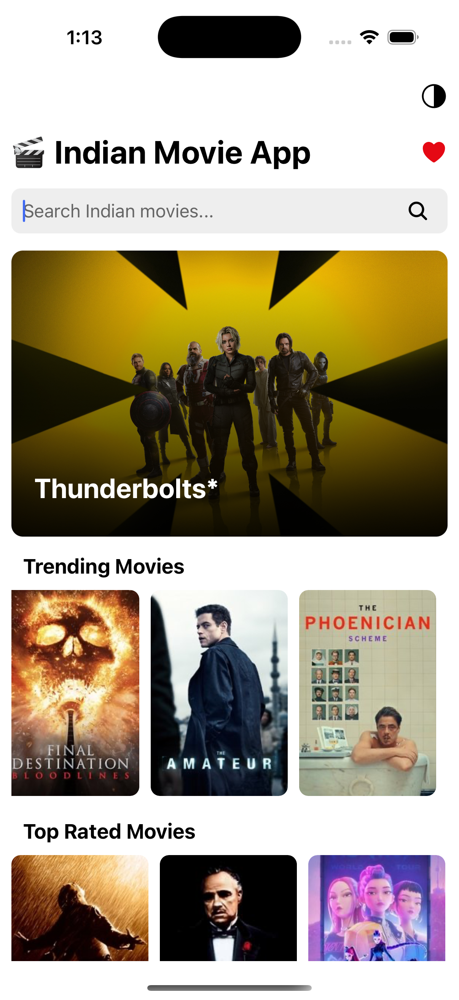

<p align="center">
  <h1 align="center">Indian-Movie-App</h1>  
</p>

## Introduction

🎬 Indian Movie App
Welcome to the Indian Movie App, a beautifully crafted React Native application that lets users discover trending Indian movies and TV shows with rich UI features and seamless navigation. The app integrates with TMDB API to fetch real-time data including movies, TV series, trailers, actor details, and more.

🌟 Key Features
🔍 Search Indian movies with real-time suggestions and recent history.

🖼️ Banner for featured movies with smooth navigation to details.

🎞️ Multiple rows for Trending, Top Rated, New Releases, and Series.

🎥 Movie Details Screen with overview, ratings, trailer, and cast.

❤️ Favorites functionality using AsyncStorage.

🧑‍🎤 Actor Details Screen with biography and known works.

🌙 Dark Mode support with a toggle.

📺 See All Screen to view full movie lists from any category.

🛠️ Tech Stack
React Native CLI

TMDB API

AsyncStorage

react-native-youtube-iframe

react-navigation

react-native-vector-icons

Custom Theme Context

---

## :camera_flash: Screenshots

<div align="center" style="margin:auto;width:100%;display:flex;justify-content:center;align-items:center;flex-wrap:wrap;">




</div>
<br>
<br>

## Development

Make Sure you have [React Native development environment setup](https://reactnative.dev/docs/environment-setup)

```bash
# Install dependencies
yarn install
or
npm install
```

```bash
# Run android
npm run android
or
yarn android
```

```bash
# Run ios
npm run ios
or
yarn ios
```
